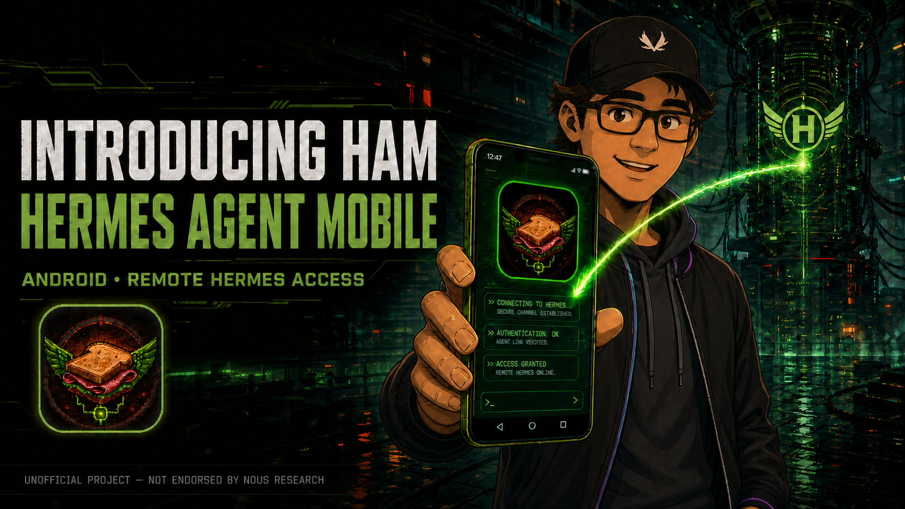
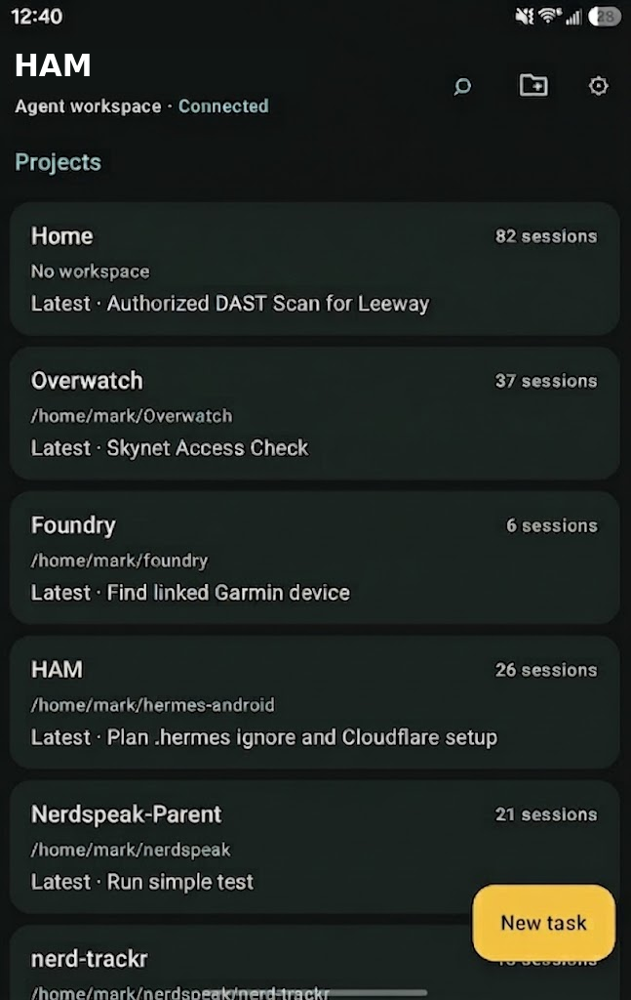
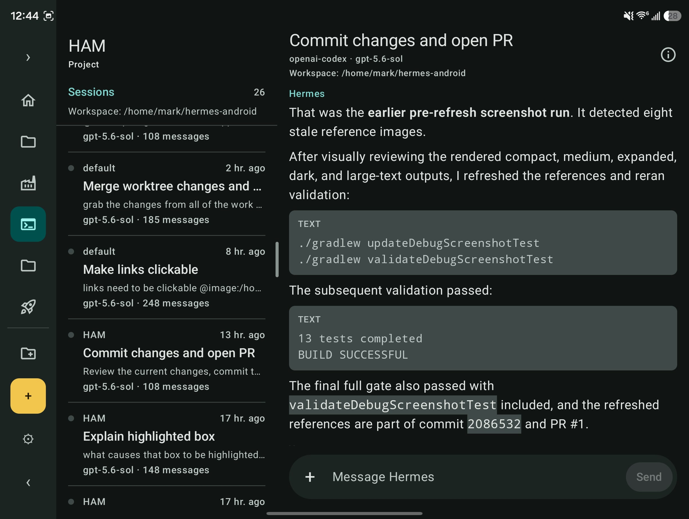
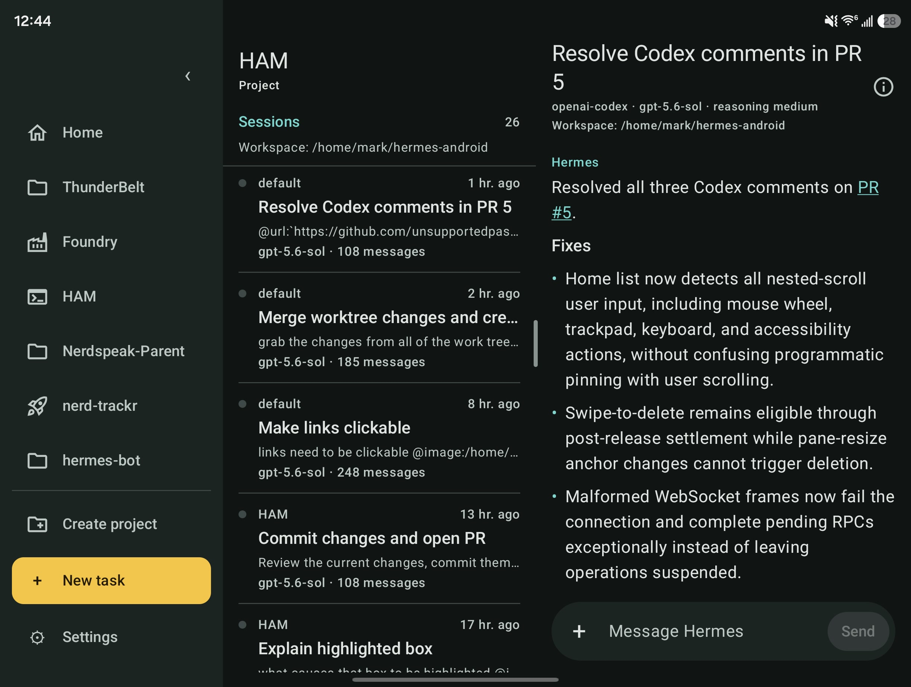

# HAM — Hermes Agent Mobile



**HAM (Hermes Agent Mobile)** is an independent, open-source Android client for [Hermes Agent](https://github.com/NousResearch/hermes-agent). The hero artwork above introduces HAM as Android access to a self-hosted Hermes agent.

> **Unofficial client.** HAM is not affiliated with or endorsed by Nous Research. The Hermes Agent project remains independently maintained and is MIT-licensed.

## What HAM does

- Connects to an unchanged, officially compatible Hermes Agent backend supplied by `hermes dashboard` or headless `hermes serve`.
- Browses projects and sessions, creates local drafts, and starts a remote runtime only when you send the first prompt.
- Streams replies, tool activity, reasoning, approvals, clarifications, managed images, and remote attachments.
- Supports native Nous OAuth with system-browser PKCE, origin-scoped encrypted credentials, refresh, and reconnect/reconciliation.
- Adapts cleanly across compact phones, Fold cover screens, unfolded layouts, split screen, freeform windows, and DeX.
- Preserves a HAM-started live turn when you navigate away; it does not take over or close another client’s runtime.

## Designed for foldables and tablets

HAM uses the available window and posture—not a device name or orientation—to move from a focused compact layout to a wider multi-pane workspace. It preserves the selected session and active work across resize and fold/unfold transitions.

<p align="center">
  
  
</p>

<p align="center">
  
</p>

## Connect to your Hermes host

HAM is a client, not an agent host. Install and configure Hermes Agent on a machine you control, then keep a compatible Hermes backend running before connecting from Android. The host remains authoritative for your agent, tools, files, sessions, and data.

### Recommended public access: HTTPS through Cloudflare Tunnel

For a remote phone connection, keep Hermes bound to loopback and publish only a public HTTPS hostname through a named [Cloudflare Tunnel](https://developers.cloudflare.com/tunnel/). Do not expose port 9119 directly to the internet.

1. Configure Hermes Agent and public-host authentication. For a publicly reachable host, use an OAuth provider (Nous Portal is the documented option), not a shared password. Follow the current [Hermes remote-backend documentation](https://hermes-agent.nousresearch.com/docs/user-guide/desktop#connecting-to-a-remote-backend).
2. Start the recommended Dashboard backend on the host and keep it supervised by your service manager:

   ```bash
   hermes dashboard --host 127.0.0.1 --port 9119 --no-open
   ```

   This supplies the backend HAM needs and also keeps the web dashboard available when you want it. Omit `--no-open` when starting it interactively and you want Hermes to open the dashboard in a local browser.

3. In Cloudflare, create a **named Tunnel** on that host and add a published application:
   - **Public hostname:** a hostname you control, such as `hermes.example.com`
   - **Service:** `http://localhost:9119`

   A locally managed tunnel uses the same mapping:

   ```yaml
   ingress:
     - hostname: hermes.example.com
       service: http://localhost:9119
     - service: http_status:404
   ```

4. In HAM, enter only `https://hermes.example.com` as the server origin, then complete the sign-in flow the server advertises. Do not include a path, API endpoint, WebSocket URL, username/password, token, authorization code, or WebSocket ticket.

Cloudflare terminates public TLS while the tunnel carries traffic back to the loopback-only Hermes server. See Cloudflare's [published-application routing](https://developers.cloudflare.com/tunnel/routing/) and [configuration-file](https://developers.cloudflare.com/cloudflare-one/connections/connect-networks/configure-tunnels/local-management/configuration-file/) guides for current setup details.

`hermes serve` is the headless alternative for hosts that only need native/remote clients and do not need the web dashboard. It and `hermes dashboard` default to the same port, so run one or the other—not both on port 9119. The separate `hermes gateway` service runs messaging platforms such as Telegram or Discord; it does not replace the backend required by HAM.

### Private access through Tailscale

If the phone and Hermes host belong to the same Tailnet, [Tailscale Serve](https://tailscale.com/docs/features/tailscale-serve) is a private alternative to publishing a public hostname. Keep Hermes authentication enabled, expose it with Tailscale Serve, and enter the exact HTTPS `.ts.net` address reported by `tailscale serve status` in HAM. Install and sign in to Tailscale on the phone before connecting.

Tailscale is appropriate for private Tailnet-only access; use the Cloudflare plus OAuth path when the host must be reachable outside the Tailnet. Do not use plain HTTP or expose port 9119 directly to the internet.

### Keeping it available and troubleshooting

The Hermes backend is long-running: if it stops, HAM cannot connect. Run the recommended `hermes dashboard --no-open`, or headless `hermes serve`, under a service manager or other process supervisor. The messaging gateway, if you use Telegram, Discord, Slack, or another channel, is a separate long-running process. See the official [dashboard reference](https://hermes-agent.nousresearch.com/docs/reference/cli-commands#hermes-dashboard), [`hermes serve` CLI reference](https://hermes-agent.nousresearch.com/docs/reference/cli-commands#hermes-serve), and [messaging guide](https://hermes-agent.nousresearch.com/docs/user-guide/messaging/) for current commands.

1. On the host, confirm the backend is running with `hermes dashboard --status` or `hermes serve --status`, matching the command you started.
2. Confirm the public host responds before opening HAM: `curl -fsS https://hermes.example.com/api/status`.
3. If it fails, inspect the named tunnel's connector state, public-hostname/DNS mapping, and TLS certificate in Cloudflare; then confirm the tunnel still targets `http://localhost:9119`.
4. For Tailscale, confirm the phone is connected to the same Tailnet and use the exact HTTPS address from `tailscale serve status`.
5. If the URL works but sign-in does not, verify the configured authentication provider and callback registration using the official Hermes guide. Do not paste credentials, cookies, tokens, or tickets into an issue.

These are connection examples, not a server provisioner: HAM does not create or modify your Hermes host, OAuth setup, Cloudflare tunnel, or Tailscale configuration.

## Security & privacy

HAM connects only to the server origin you configure. It does not include a hosted Hermes service, telemetry SDK, analytics SDK, ad network, or hard-coded remote endpoint.

- Credentials, cookies, connection state, and cached transcripts are scoped to the normalized server origin.
- WebSocket tickets are fresh, single-use, and held in memory only.
- Production connections should use HTTPS. Cleartext traffic is disabled in the manifest.
- Your prompts, attachments, and transcript data are processed by the Hermes server you choose—not by a HAM-operated service.

See [PRIVACY.md](PRIVACY.md) and [SECURITY.md](SECURITY.md) for details.

## Status

HAM is pre-release software. It is being prepared for an initial Google Play release and is not yet a published Play Store app. See [release readiness](docs/release-readiness.md) for the remaining shipping checklist.

## Build from source

### Prerequisites

- JDK 17
- Android SDK platform corresponding to the project’s configured `compileSdk`
- An Android device or emulator for runtime verification

Create an untracked `local.properties` with your SDK path, then run:

```bash
./gradlew testDebugUnitTest lintDebug assembleDebug validateDebugScreenshotTest
```

The debug APK is written to `app/build/outputs/apk/debug/`.

For local setup and runtime checks, see [docs/setup.md](docs/setup.md) and [docs/testing.md](docs/testing.md).

## Contributing

Contributions are welcome. Read [CONTRIBUTING.md](CONTRIBUTING.md) and [AGENTS.md](AGENTS.md) before opening an issue or pull request. HAM must stay a client of released, official Hermes interfaces—no private backend route, plugin, dashboard extension, gateway worker, or server fork is a requirement for the app.

## License

HAM is released under the [MIT License](LICENSE). Third-party components retain their own licenses.
